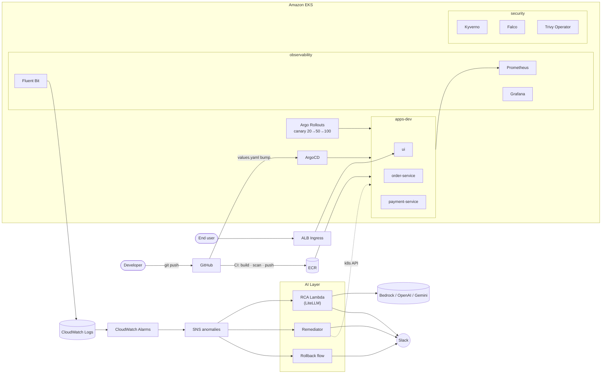

# IntelliOps

> **AI-Powered Cloud-Native Observability Platform**
> LLM-driven root-cause analysis, autonomous remediation, canary GitOps, DevSecOps.

An end-to-end reference architecture that turns a plain EKS cluster into a self-healing platform. Anomalies detected by CloudWatch fan out to a multi-LLM RCA Lambda (Bedrock / OpenAI / Gemini via LiteLLM), auto-remediation Lambdas act on safe categories, and risky actions (like deployment rollback) require a Slack-approved button click.

---

## Architecture



Detailed diagrams in [`docs/architecture.md`](docs/architecture.md).
Step-by-step AWS deployment with cost controls in [`construct.md`](construct.md).

---

## Highlights

| # | Feature |
|---|---|
| 1 | **Multi-LLM RCA** — provider (Bedrock / OpenAI / Gemini) chosen by a single Terraform variable. Same Lambda code via LiteLLM. |
| 2 | **Autonomous remediation** — scale, restart, cordon actions execute automatically for safe categories |
| 3 | **Human-in-the-loop for rollback** — Slack interactive message with signed HMAC callback via API Gateway |
| 4 | **Canary progressive delivery** — 20% → 50% → 100% via Argo Rollouts, defined in Helm values |
| 5 | **DevSecOps CI** — 5-gate pipeline: Gitleaks (hard), Trivy image (hard), pip-audit / Bandit / Trivy IaC (soft) |
| 6 | **Runtime security** — Kyverno admission + Falco eBPF + Trivy Operator + default-deny NetworkPolicies |
| 7 | **Structured logs → CloudWatch Logs Insights** — feeds Claude the actual error text for RCA quality |
| 8 | **SageMaker LSTM notebook** — reference ML implementation alongside the managed-detector runtime path |

---

## Stack

| Layer | Technology |
|---|---|
| Infrastructure | Terraform + Terragrunt (10 per-module units) |
| Cloud | AWS — VPC · EKS 1.33 · ECR · ALB · Kinesis · DynamoDB · Bedrock · Secrets Manager · CloudWatch · API Gateway |
| Autoscaling | Karpenter (spot + on-demand) · HPA |
| CI/CD | GitHub Actions → ArgoCD |
| GitOps | ArgoCD v2.12 + ApplicationSet |
| Progressive Delivery | Argo Rollouts — canary 20 → 50 → 100 |
| Observability | Prometheus + Grafana + Fluent Bit → CloudWatch |
| AI Runtime | LiteLLM · Bedrock Claude Sonnet 4.6 (default) · OpenAI GPT-4o · Gemini 2.0 |
| AI Training | SageMaker LSTM (Jupyter notebook + inference script) |
| Auto-Remediation | Lambda + EKS API (IRSA + Access Entry) + API Gateway |
| Security — CI | Gitleaks · Trivy image · Trivy IaC · pip-audit · Bandit |
| Security — Cluster | Kyverno · Falco · Trivy Operator · External Secrets · Network Policies |
| Apps | Python FastAPI (structured JSON logs, X-Request-ID propagation, fault injection endpoints) |

---

## Phases

| # | Phase | Status |
|---|---|---|
| 1 | Infrastructure + CI | ✅ |
| 2 | CD + GitOps + Canary | ✅ |
| — | DevSecOps CI Gates | ✅ |
| 3 | Complete Observability — logs pipeline + app instrumentation | ✅ |
| 4 | **AI/ML Engine** — Multi-LLM RCA + SageMaker notebook + Kinesis + DynamoDB | ✅ |
| 4.5 | CloudWatch Alarms as autonomous anomaly source | ✅ |
| 5 | Auto-Remediation — 3 Lambdas + Slack-approved rollback | ✅ |
| 6 | Security Hardening — Kyverno · Falco · Trivy Operator · ESO · NetworkPolicies | ✅ |
| — | `terraform apply` on real AWS | ⏸ On-demand (see [construct.md](construct.md)) |

---

## Repository Layout

```
intelliops/
├── .github/workflows/    CI · CD · Chaos pipelines
├── ai/anomaly-model/     SageMaker LSTM notebook + inference
├── docs/                 Architecture & workflow diagrams
├── helm/
│   ├── order-service/    · payment-service/ · ui/
│   ├── monitoring/       kube-prometheus-stack + Grafana dashboard
│   ├── fluent-bit/       logs → CloudWatch
│   └── security/         Kyverno · Falco · Trivy · ESO · NetworkPolicies
├── infra/
│   ├── modules/          10 Terraform modules
│   └── envs/dev/         per-module Terragrunt units
├── k8s/
│   ├── apps/             FastAPI service source
│   └── argocd/           Project · ApplicationSet · bootstrap · per-app manifests
├── lambda/
│   ├── rca_generator/    Multi-LLM RCA (LiteLLM)
│   ├── remediator/       Auto-actions via EKS API
│   ├── rollback_request/ Slack approval message
│   └── rollback_execute/ API Gateway target
├── construct.md          Step-by-step AWS build
└── docker-compose.yml    Local dev stack
```

---

## Quick Start — Local

```bash
docker-compose up -d
```

| Component | URL |
|---|---|
| UI | http://localhost:8080 |
| payment-service | http://localhost:8081 |
| order-service | http://localhost:8082 |
| Prometheus | http://localhost:9090 |
| Grafana | http://localhost:3000 (admin / admin) |

---

## Deploy on AWS

Step-by-step with cost estimates and teardown in **[`construct.md`](construct.md)**.

TL;DR:

```bash
# 1. One-time setup (Terraform state bucket, GitHub OIDC role, Slack app)
# 2. Set env vars: SLACK_WEBHOOK_URL, TF_VAR_llm_provider, TF_VAR_slack_signing_secret, TF_VAR_argocd_api_token
# 3. Provision infra
cd infra/envs/dev && terragrunt run-all apply

# 4. Bootstrap ArgoCD + Argo Rollouts + all apps
bash k8s/argocd/install/bootstrap.sh

# 5. Grab the ALB URL
kubectl get ingress -n apps-dev
```

Switching LLM provider is a one-line change:
```bash
export TF_VAR_llm_provider=openai
export TF_VAR_llm_model="openai/gpt-4o"
export TF_VAR_openai_api_key=sk-...
cd infra/envs/dev/llm && terragrunt apply
```

---

## What Happens on `git push`

1. **Gitleaks** blocks the pipeline if any secret is detected
2. In parallel: **Trivy** scans Helm + Terraform for misconfigs (soft)
3. In parallel per service: build → **pip-audit** → **Bandit** → **Trivy image** → push to ECR
4. CI writes the new image tag back to `helm/<service>/values.yaml`
5. **ArgoCD** detects the change and syncs
6. **Argo Rollouts** rolls out the new version as canary: 20 → pause → 50 → pause → 100
7. Prometheus scrapes new pods, Fluent Bit ships structured logs to CloudWatch Logs
8. If a **CloudWatch alarm** fires (HighCPU, HighMemory, HighErrorRate):
   - SNS fans the anomaly to three Lambdas
   - **RCA Lambda** queries logs + past incidents, prompts Claude Sonnet 4.6, posts a narrative to Slack, writes audit to DynamoDB
   - **Remediator** patches the Argo Rollout (scale/restart) or cordons the node via EKS API
   - **DeployRegression** anomalies → Slack approval message → click Approve → API Gateway → ArgoCD rollback

---

## Design Notes

- **GitOps as source of truth** — CI commits image tags back to Git; ArgoCD reacts to that commit. No cluster state drifts silently.
- **Multi-LLM by deploy-time flag** — the Lambda code is provider-agnostic via LiteLLM. Switching Bedrock → OpenAI → Gemini is one env var + one Terraform variable.
- **Managed anomaly detection over custom LSTM** — the SageMaker LSTM notebook is a demonstrable ML artifact, but the runtime path uses CloudWatch alarms with anomaly-detection bands to keep costs down (~$5/mo vs ~$72/mo for a SageMaker endpoint).
- **Kyverno mostly in Audit mode** — findings surface in PolicyReport CRs without blocking deploys. `disallow-privileged` is Enforce because privileged escape is a real footgun. Flip others to Enforce once workloads comply.
- **SNS filter policies removed, filter in Lambda** — CloudWatch alarms don't carry `anomaly_type` at the top level, so routing lives in the Lambda handlers (skip_unhandled paths return immediately). Trades a bit of Lambda invocation cost for message-source flexibility.
- **DevSecOps is opinionated** — Gitleaks is hard (secrets = incident); every other scanner is soft to avoid alert fatigue.
- **Karpenter + spot** — the workload node group scales elastically on cheap spot capacity while system add-ons stay pinned to tainted on-demand nodes.
- **UI is the only external entry** — order and payment services stay ClusterIP-only, called via internal DNS.
- **Fault-injection endpoints** — `/admin/inject/*` on order + payment services (behind `ENABLE_FAULT_INJECTION`) let the chaos GitHub workflow drive real anomalies end-to-end.

---

## Cost

| Setup | $/mo |
|---|---|
| Full stack running 24/7 | ~$250 |
| Full stack, torn down between demos | ~$0 |

Fixed baseline (EKS control plane + NAT Gateway + 2 nodes) is ~$170. See [`construct.md`](construct.md) for a detailed cost breakdown and teardown steps that return to zero.

---

## Not Included (by design)

- **HTTPS on the ALB** — add cert-manager + ACM for production
- **Multi-environment (`prod`, `staging`)** — pattern is there in Terragrunt, just needs another `envs/` folder
- **Real ExternalSecret resources** — ESO is deployed and a ClusterSecretStore for AWS Secrets Manager is included, but nothing currently syncs into a K8s Secret (all secrets are consumed by Lambdas via IAM)
- **VPC config for the rollback Lambda** — currently runs outside the VPC, so if ArgoCD is on ClusterIP it can't be reached. Rollback executes as a dry-run audit entry in that case. Adding VPC config is a small extension noted in the code.

Built as a portfolio project. Contributions and questions welcome.
