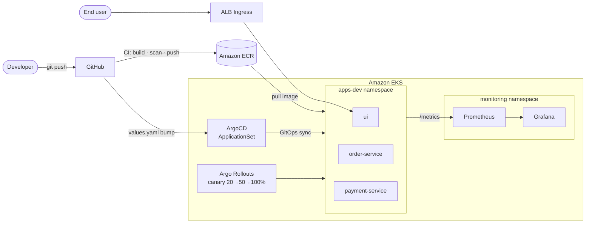

# IntelliOps

> End-to-end cloud-native platform demonstrating modern DevOps: **Infrastructure as Code · GitOps · Progressive Delivery · Observability · DevSecOps**.

Two Python microservices (`order-service`, `payment-service`) plus a `ui` frontend, deployed to Amazon EKS through ArgoCD with canary rollouts, Prometheus + Grafana observability, and a security-first CI pipeline.

---

## Architecture



Detailed diagrams in [`docs/architecture.md`](docs/architecture.md).

---

## Stack

| Layer | Technology |
|---|---|
| Infrastructure | Terraform + Terragrunt |
| Cloud | AWS — VPC · EKS 1.30 · ECR · ALB |
| Autoscaling | Karpenter (spot + on-demand) · HPA |
| CI | GitHub Actions — build · Trivy scan · push |
| CD | GitHub Actions → ArgoCD CLI sync |
| GitOps | ArgoCD + ApplicationSet |
| Progressive Delivery | Argo Rollouts — canary 20% → 50% → 100% |
| Observability | Prometheus + Grafana (kube-prometheus-stack) |
| DevSecOps | Gitleaks · pip-audit · Bandit · Trivy (image + IaC) |
| Apps | Python FastAPI |

---

## Phases

| # | Phase | Status |
|---|---|---|
| 1 | Infrastructure + CI | ✅ Complete |
| 2 | CD + GitOps + Canary | ✅ Complete |
| — | DevSecOps CI Gates | ✅ Complete |
| 3 | In-cluster Observability | ✅ Complete |
| 4 | UI + Ingress (ALB) | ✅ Complete |
| — | `terraform apply` on real AWS | ⏸ Not run (costs ~$100/mo) |

---

## Repository Layout

```
intelliops/
├── .github/workflows/    CI + CD pipelines
├── docs/                 Architecture & workflow diagrams
├── helm/                 Helm charts — order · payment · ui · monitoring
├── infra/                Terraform modules + Terragrunt env config
├── k8s/
│   ├── apps/             App source (FastAPI + Dockerfiles)
│   ├── argocd/           ArgoCD Project · ApplicationSet · Rollouts · bootstrap
│   └── karpenter/        Karpenter NodePool
└── docker-compose.yml    Local dev stack
```

---

## Quick Start (Local)

```bash
docker-compose up -d
```

| Component | URL |
|---|---|
| UI | http://localhost:8080 |
| payment-service | http://localhost:8081 |
| order-service | http://localhost:8082 |
| Prometheus | http://localhost:9090 |
| Grafana | http://localhost:3000 (admin / admin) |

---

## Deploy to EKS

**Prerequisites**
- AWS account with credentials configured
- GitHub repository secrets: `AWS_ACCOUNT_ID`, `AWS_GITHUB_ACTIONS_ROLE`
- S3 bucket `intelliops-tfstate-dev` for Terraform state

**Steps**

```bash
# 1. Provision AWS infra (VPC + ECR + EKS + Karpenter + ALB Controller)
cd infra/envs/dev
terragrunt run-all apply

# 2. Bootstrap ArgoCD + Argo Rollouts on the cluster
bash k8s/argocd/install/bootstrap.sh        # or bootstrap.ps1 on Windows
```

ArgoCD's `ApplicationSet` takes over — it deploys `ui`, `order-service`, `payment-service`, and the monitoring stack. Grab the external URL:

```bash
kubectl get ingress -n apps-dev
```

---

## What Happens on `git push`

1. **Gitleaks** blocks the pipeline if any secret is detected
2. In parallel: **Trivy** scans Helm + Terraform for misconfigs (soft gate)
3. In parallel: build → **pip-audit** → **Bandit** → **Trivy** container scan → push to ECR
4. CI writes the new image tag back to `helm/<service>/values.yaml`
5. **ArgoCD** detects the change and starts syncing
6. **Argo Rollouts** rolls out the new version as a canary: 20% → pause → 50% → pause → 100%
7. **Prometheus** scrapes metrics; **Grafana** dashboard shows request rate, error rate, P95 latency, revenue

---

## Design Notes

- **Terragrunt per-module units** (`envs/dev/vpc`, `envs/dev/ecr`, `envs/dev/eks`) — each deploys independently with proper dependency ordering.
- **GitOps as the source of truth** — the CI pipeline commits the image tag back to Git; ArgoCD reacts to that commit. No cluster state drifts silently.
- **UI is the only external entry point** — order and payment services stay ClusterIP-only, called via internal cluster DNS.
- **DevSecOps is opinionated** — Gitleaks is a hard gate (secrets = incident, rotate immediately); every other scanner is soft-gated (report, don't block) to avoid alert fatigue.
- **Karpenter + spot instances** — the workload node group scales elastically on cheap capacity while system add-ons stay pinned to tainted on-demand nodes.

---

## Not Included (by design)

- Real secrets management (services are stateless with in-memory storage — no need)
- TLS on the ALB (add cert-manager + ACM for production)
- Multi-environment (`prod`, `staging`) — pattern is there in Terragrunt, just needs another `envs/` folder

Built as a portfolio project. Contributions and questions welcome.
