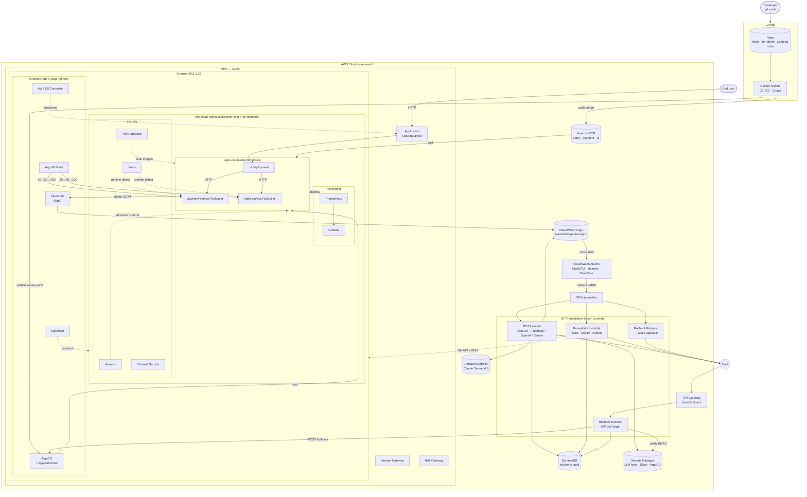
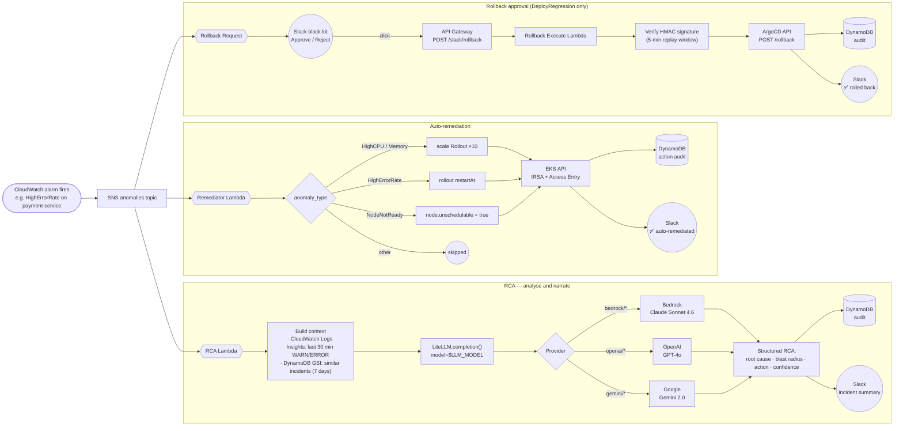
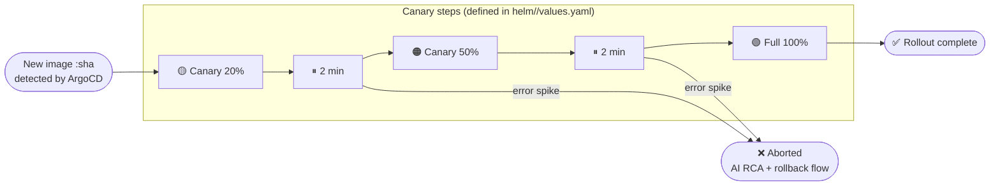
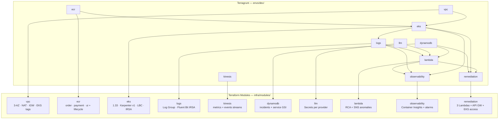

# IntelliOps — Architecture & Workflow Diagrams

---

## 1. End-to-End CI/CD Pipeline

```mermaid
flowchart LR
    DEV(["Developer"])

    subgraph GH ["GitHub"]
        REPO[(Repository)]

        subgraph SECRET ["Hard Gate — Secret Scan"]
            GITLEAKS["Gitleaks\nfull git history"]
        end

        subgraph IAC ["Soft Gate — IaC Config Scan  (parallel)"]
            TRIVY_IAC["Trivy config\nhelm/ · infra/"]
        end

        subgraph CI ["GitHub Actions — CI  (per service)"]
            direction TB
            CI1["① Checkout + OIDC Auth"]
            CI2["② unit tests"]
            CI3["③ pip-audit  (soft)"]
            CI4["④ Bandit SAST  (soft)"]
            CI5["⑤ docker build"]
            CI6["⑥ Trivy image scan\nCRITICAL = hard fail"]
            CI7["⑦ push :sha + :latest → ECR"]
            CI8["⑧ bump values.yaml\ngit rebase + push"]
            CI1 --> CI2 --> CI3 --> CI4 --> CI5 --> CI6 --> CI7 --> CI8
        end

        HELM_LINT["Helm Lint + template validate"]

        subgraph CD ["GitHub Actions — CD  (on CI success)"]
            direction TB
            CD1["⑨ OIDC Auth + kubeconfig"]
            CD2["⑩ argocd login"]
            CD3["⑪ argocd app sync\npayment · order · ui"]
            CD4["⑫ argocd app wait --health"]
            CD1 --> CD2 --> CD3 --> CD4
        end
    end

    ECR[("Amazon ECR")]

    subgraph EKS_BOX ["Amazon EKS"]
        ARGO["ArgoCD\nApplicationSet"]
        ROLLOUTS["Argo Rollouts\ncanary 20 → 50 → 100"]
        APPS["apps-dev namespace"]
    end

    DEV -->|git push| REPO
    REPO --> GITLEAKS
    GITLEAKS --> IAC
    GITLEAKS --> CI
    CI --> HELM_LINT
    HELM_LINT --> CD
    CI7 --> ECR
    CI8 -->|values.yaml diff| ARGO
    CD3 -->|explicit sync| ARGO
    ECR -->|pull image| APPS
    ARGO -->|ApplicationSet sync| APPS
    ROLLOUTS --> APPS
```

---

## 2. Platform Architecture

---

## 3. Anomaly → RCA → Remediation Flow

---

## 4. Canary Deployment Strategy  (Argo Rollouts)

---

## 5. Infrastructure — Terragrunt Module Graph

---

## 6. Security Layer (Phase 6)

```mermaid
flowchart LR
    subgraph SHIFT_LEFT ["Shift Left — pre-cluster"]
        GITLEAKS_2[Gitleaks<br/>hard block]
        TRIVY_IMG[Trivy image scan<br/>CRITICAL hard block]
        TRIVY_CFG[Trivy IaC<br/>soft report]
        PIP[pip-audit<br/>soft report]
        BANDIT[Bandit SAST<br/>soft report]
    end

    subgraph ADMIT ["Admission — Kyverno ClusterPolicies"]
        POL1[disallow-latest-tag<br/>Audit]
        POL2[require-resource-limits<br/>Audit]
        POL3[require-non-root<br/>Audit]
        POL4[require-probes<br/>Audit]
        POL5[disallow-privileged<br/>Enforce]
    end

    subgraph RUNTIME ["Runtime — in-cluster"]
        FALCO_R[Falco DaemonSet<br/>syscall anomalies → Slack]
        TRIVY_OP_R[Trivy Operator<br/>continuous CVE + config + RBAC]
        NETPOL[NetworkPolicies<br/>default-deny + explicit allows]
        ESO_R[External Secrets Operator<br/>Secrets Manager → K8s Secrets]
    end

    SHIFT_LEFT --> ADMIT
    ADMIT --> RUNTIME
```

---

## 7. Component Summary

| Layer | Technology | Status |
|---|---|---|
| Infrastructure | Terraform + Terragrunt (10 modules) | Code complete |
| Container Registry | Amazon ECR — order · payment · ui | Code complete |
| Cluster | Amazon EKS 1.33 + Karpenter v1 + IRSA + AWS LB Controller | Code complete |
| Log Pipeline | Fluent Bit DaemonSet → CloudWatch Logs (structured JSON) | Code complete |
| Metrics | Prometheus + Grafana + kube-prometheus-stack | Code complete |
| CloudWatch | Container Insights + metric-filter alarms + SNS | Code complete |
| CI | GitHub Actions — build · Trivy · push · helm lint | Complete |
| DevSecOps CI Gates | Gitleaks (hard) · pip-audit · Bandit · Trivy IaC (soft) | Complete |
| CD | GitHub Actions → ArgoCD CLI sync | Complete |
| GitOps | ArgoCD v2.12 + ApplicationSet | Complete |
| Canary | Argo Rollouts — 20% → 50% → 100% (in Helm charts) | Complete |
| Apps | FastAPI — order · payment · ui with fault-injection endpoints | Complete |
| External Access | ALB Ingress on ui service | Complete |
| AI/ML — Runtime | LiteLLM abstraction: Bedrock Claude Sonnet 4.6 (default), OpenAI, Gemini | Complete |
| AI/ML — Training | SageMaker LSTM notebook (reference implementation) | Complete |
| Auto-Remediation | 3 Lambdas: scale · restart · cordon (via EKS API + IRSA) | Complete |
| Rollback Flow | Slack interactive → API GW → HMAC verify → ArgoCD API | Complete |
| Audit | DynamoDB incidents table with service-index GSI | Complete |
| Streaming | Kinesis Data Streams (metrics + events) | Complete |
| Security — Admission | Kyverno + 5 baseline ClusterPolicies | Complete |
| Security — Runtime | Falco (eBPF) + Trivy Operator + Network Policies | Complete |
| Security — Secrets | External Secrets Operator + ClusterSecretStore for Secrets Manager | Complete |
