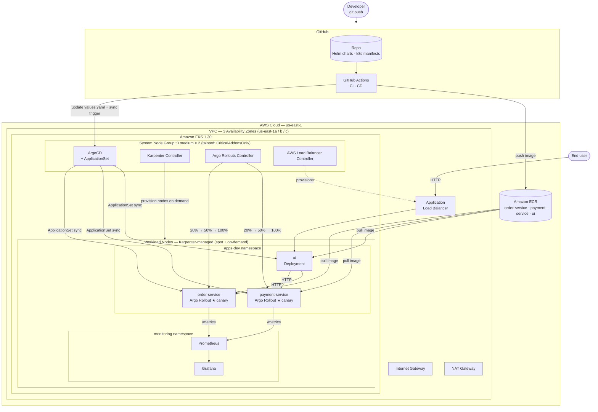
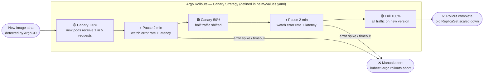
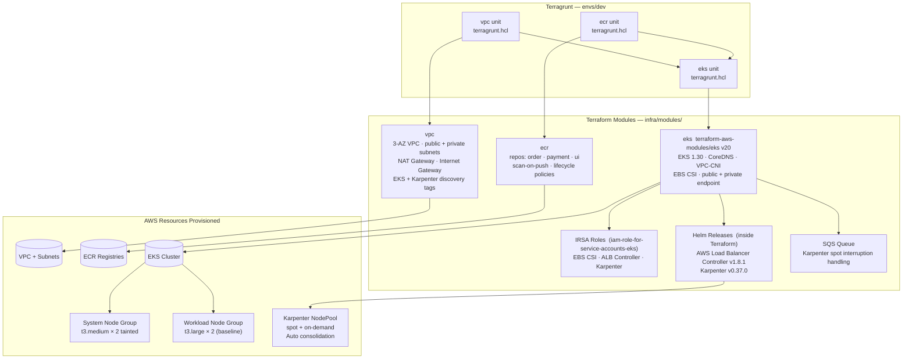

# IntelliOps — Architecture & Workflow Diagrams

---

## 1. End-to-End CI/CD Pipeline

```mermaid
flowchart LR
    DEV(["Developer"])

    subgraph GH ["GitHub"]
        REPO[(Repository\nmain · feature/**)]

        subgraph SECRET ["Hard Gate — Secret Scan"]
            GITLEAKS["Gitleaks\nfull git history"]
        end

        subgraph IAC ["Soft Gate — IaC Config Scan  (parallel)"]
            TRIVY_IAC["Trivy config\nhelm/ · infra/"]
        end

        subgraph CI ["GitHub Actions — CI"]
            direction TB
            CI1["① Checkout + OIDC Auth"]
            CI2["② unit tests"]
            CI3["③ pip-audit  (soft)"]
            CI4["④ Bandit SAST  (soft)"]
            CI5["⑤ docker build"]
            CI6["⑥ Trivy image scan\nCRITICAL = hard fail"]
            CI7["⑦ push :sha + :latest → ECR"]
            CI8["⑧ bump values.yaml\ngit rebase + push"]
            CI1 --> CI2 --> CI3 --> CI4 --> CI5 --> CI6 --> CI7 --> CI8
        end

        HELM_LINT["Helm Lint + template validate"]

        subgraph CD ["GitHub Actions — CD  (on CI success)"]
            direction TB
            CD1["⑨ OIDC Auth + kubeconfig"]
            CD2["⑩ argocd login (via port-forward)"]
            CD3["⑪ argocd app sync\npayment · order · ui"]
            CD4["⑫ argocd app wait --health"]
            CD1 --> CD2 --> CD3 --> CD4
        end
    end

    ECR[("Amazon ECR")]

    subgraph EKS_BOX ["Amazon EKS"]
        ARGO["ArgoCD\nApplicationSet"]
        ROLLOUTS["Argo Rollouts\ncanary 20 → 50 → 100"]
        APPS["apps-dev namespace"]
    end

    DEV -->|git push| REPO
    REPO --> GITLEAKS
    GITLEAKS --> IAC
    GITLEAKS --> CI
    CI --> HELM_LINT
    HELM_LINT --> CD
    CI7 --> ECR
    CI8 -->|values.yaml diff| ARGO
    CD3 -->|explicit sync| ARGO
    ECR -->|pull image| APPS
    ARGO -->|ApplicationSet sync| APPS
    ROLLOUTS --> APPS
```

---

## 2. Platform Architecture

---

## 3. Canary Deployment Strategy  (Argo Rollouts)

---

## 4. Infrastructure — Terragrunt Module Graph

---

## 5. Component Summary

| Layer | Technology | Status |
|---|---|---|
| Infrastructure | Terraform + Terragrunt (VPC · ECR · EKS) | Code complete |
| Container Registry | Amazon ECR — order · payment · ui | Code complete |
| Node Autoscaling | Karpenter v0.37.0 + SQS spot interruption | Provisioned via Terraform |
| Ingress | AWS Load Balancer Controller v1.8.1 | Provisioned via Terraform |
| CI Pipeline | GitHub Actions — build · Trivy scan · push · helm lint | Complete |
| DevSecOps | Gitleaks (hard) · pip-audit · Bandit · Trivy IaC (soft) | Complete |
| CD Pipeline | GitHub Actions → ArgoCD CLI sync | Complete |
| GitOps | ArgoCD v2.12.0 + ApplicationSet | Complete |
| Canary Deploys | Argo Rollouts v1.7.2 — 20% → 50% → 100% (in Helm charts) | Complete |
| App Services | FastAPI (Python) — order · payment · ui | Complete |
| External Access | ALB Ingress on ui service | Complete |
| Observability | kube-prometheus-stack (Prometheus + Grafana) | Complete |
