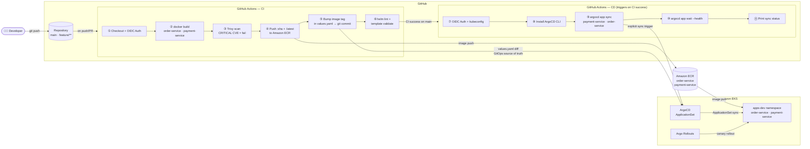
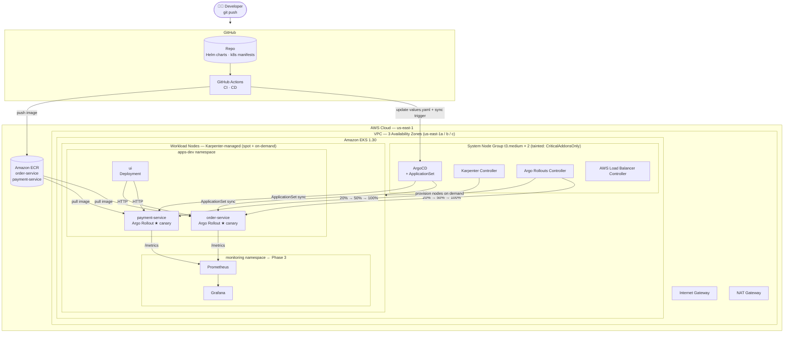
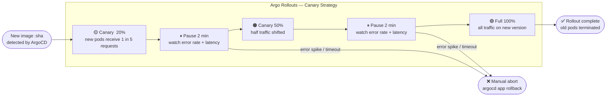
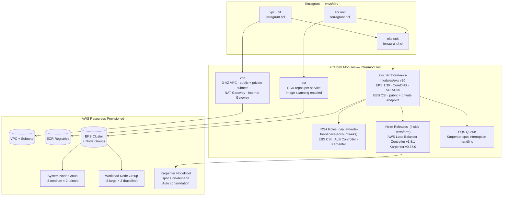

# IntelliOps — Architecture & Workflow Diagrams

---

## 1. End-to-End CI/CD Pipeline

---

## 2. Platform Architecture

---

## 3. Canary Deployment Strategy  (Argo Rollouts)

---

## 4. Infrastructure — Terragrunt Module Graph

---

## 5. Component Summary

| Layer | Technology | Status |
|---|---|---|
| Infrastructure | Terraform + Terragrunt (VPC · ECR · EKS) | Code complete, not applied |
| Container Registry | Amazon ECR | Code complete, not applied |
| Node Autoscaling | Karpenter v0.37.0 + SQS spot interruption | Provisioned via Terraform |
| Ingress | AWS Load Balancer Controller v1.8.1 | Provisioned via Terraform |
| CI Pipeline | GitHub Actions — build · Trivy scan · push · helm lint | Done |
| CD Pipeline | GitHub Actions → ArgoCD CLI sync | Done |
| GitOps | ArgoCD v2.12.0 + ApplicationSet | Done |
| Canary Deploys | Argo Rollouts v1.7.2 — 20% → 50% → 100% | Done |
| App Services | FastAPI (Python) — order · payment · ui | Done |
| Observability | Prometheus + Grafana | Local only — Phase 3 pending |
| Secrets | — | Not yet implemented |
